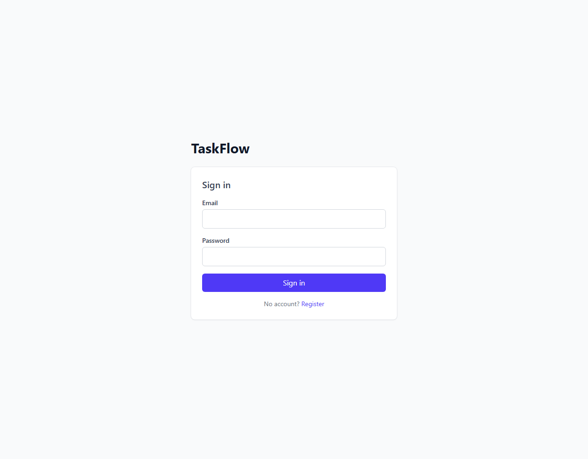
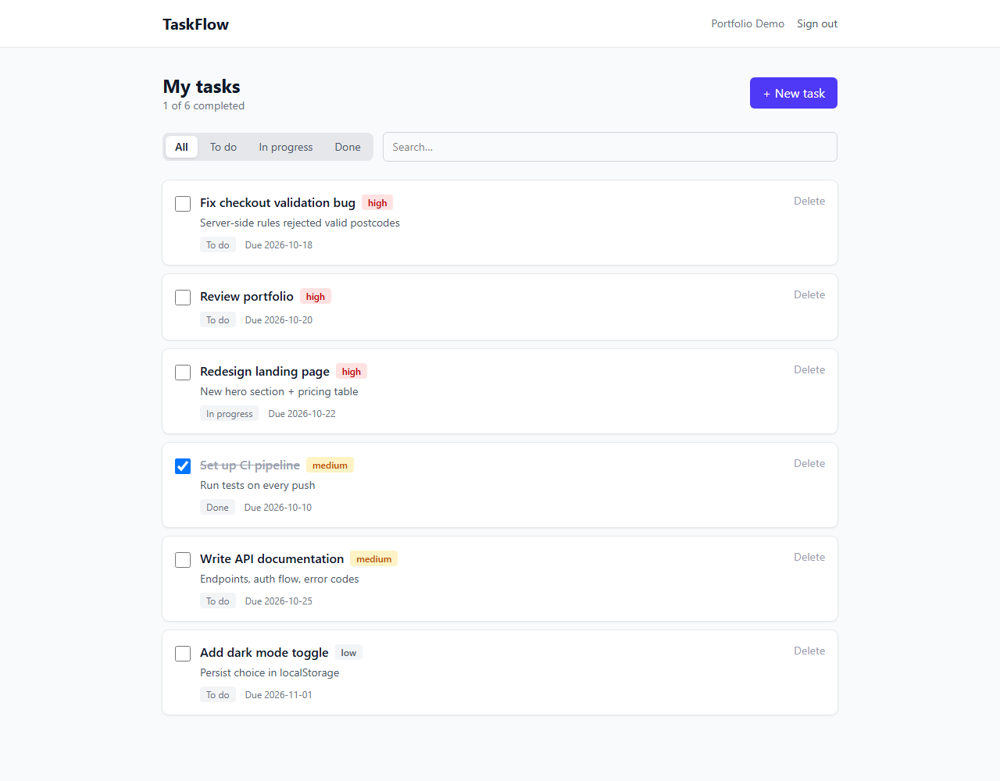

# TaskFlow

A minimal task-management app. React + Tailwind frontend, Laravel + Sanctum backend.

[](https://github.com/Chrismastian/task-frontend/actions/workflows/ci.yml)

**[▶ Live demo](https://task-frontend-ruddy-five.vercel.app)** · **[Backend API](https://github.com/Chrismastian/task-api)**




## Stack

| Layer | Tech |
|-------|------|
| Framework | React 19 + Vite |
| Styling | Tailwind CSS v4 |
| Routing | React Router 7 |
| HTTP | Axios (with auth + 401 interceptors) |
| Backend | Laravel 10 + Sanctum (separate repo) |

## Features

- Register / login with JWT-style Sanctum tokens
- Create / edit / delete tasks
- Mark tasks done (auto-stamps `completed_at`)
- Filter by status (All / To do / In progress / Done)
- Search by title
- Responsive layout

## Local development

```bash
npm install
cp .env.example .env  # then edit VITE_API_URL
npm run dev
```

The backend must be running on the URL in `VITE_API_URL`. See the backend repo for setup instructions.

## Build

```bash
npm run build
```

Output goes to `dist/`. Deploy to Vercel, Netlify, or any static host.
